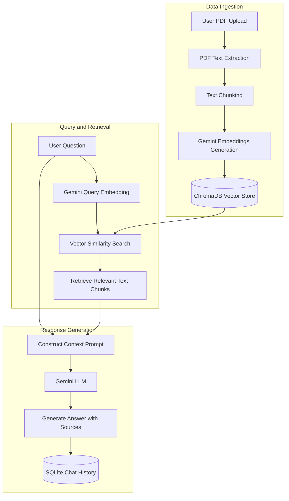

# AI Document Assistant

This is an AI-powered Document Assistant backend. It lets you upload PDF documents and ask questions about them. The system extracts text from the files, cuts it into small sections, generates vector embeddings, and stores them in ChromaDB. When you ask a question, it searches the database for relevant sections and uses Google Gemini to answer with source citations. It also saves your conversation history in a SQLite database.

## Prerequisites

You need Python 3.10 or higher installed on your computer.

## Installation

First, clone this repository and go to the project directory.

Run the following command to install the required packages:

```bash
pip install -r requirements.txt
```

## Configuration

Copy the example environment file and name it .env:

```bash
copy .env.example .env
```

Open the newly created .env file and replace the placeholder value with your actual Google Gemini API key:

```env
GEMINI_API_KEY=your_actual_api_key_here
```

## Running the Application

You can start the FastAPI server by running this command in your terminal:

```bash
uvicorn main:app --reload
```

The server will start on http://127.0.0.1:8000. You can access the interactive API documentation at http://127.0.0.1:8000/docs.

## API Endpoints

### 1. Upload Document
* **Endpoint:** `POST /upload`
* **Content-Type:** `multipart/form-data`
* **Request Body:** `file` (PDF file)
* **Response Example:**
  ```json
  {
    "message": "File uploaded and indexed successfully",
    "filename": "sample.pdf",
    "chunks_created": 12
  }
  ```

### 2. Query Assistant
* **Endpoint:** `POST /query`
* **Content-Type:** `application/json`
* **Request Body:**
  ```json
  {
    "query": "What is the company policy on remote work?",
    "session_id": "optional-custom-session-id"
  }
  ```
* **Response Example:**
  ```json
  {
    "session_id": "optional-custom-session-id",
    "query": "What is the company policy on remote work?",
    "answer": "According to the document, employees are allowed to work remotely up to two days a week.",
    "sources": [
      "sample.pdf (Page 3)"
    ]
  }
  ```

### 3. Retrieve Session History
* **Endpoint:** `GET /history/{session_id}`
* **Response Example:**
  ```json
  {
    "session_id": "optional-custom-session-id",
    "history": [
      {
        "query": "What is the company policy on remote work?",
        "response": "According to the document, employees are allowed to work remotely up to two days a week.",
        "sources": [
          "sample.pdf (Page 3)"
        ],
        "created_at": "2026-06-30T10:40:00Z"
      }
    ]
  }
  ```

### 4. List Uploaded Documents
* **Endpoint:** `GET /documents`
* **Response Example:**
  ```json
  {
    "documents": [
      "sample.pdf"
    ]
  }
  ```

## Architecture Diagram

The diagram below shows the flow of data for document uploading, indexing, and query resolution:



